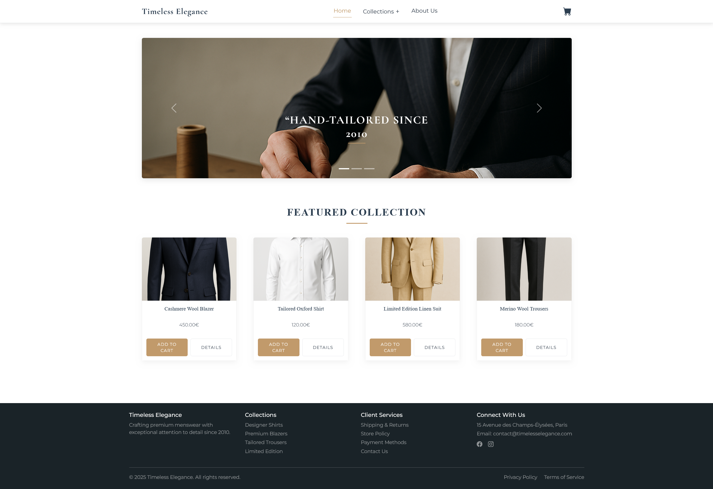
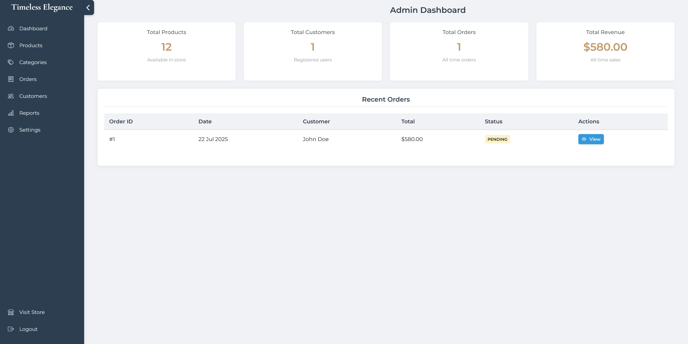

# Timeless Elegance - Premium Men's Clothing E-Shop

## Overview

**Timeless Elegance** is a refined e-commerce platform tailored for premium men's clothing. Designed with a focus on elegance and usability, it combines PHP, MySQL, Bootstrap 5, and JavaScript to deliver a seamless, luxurious shopping experience across devices.

The system offers a responsive user interface for customers and a comprehensive admin dashboard for managing products, orders, and store configurations.

**[Click here to watch the demo video](https://youtu.be/9eMKdVKOpF0)**

<div align="center">
  <!-- force both images to 250px tall, widths auto‑scaled -->
  &nbsp;&nbsp;
  
</div>

<p align="center">
  <em>Left: E-Shop Homepage | Right: Admin Dashboard</em>
</p>


## Features

### Customer-Facing Features
- Responsive layout for desktop, tablet, and mobile views  
- Product catalog with filtering by price and category  
- Detailed product pages with variant selection (color, size, quantity)  
- Special styling for sale items  
- “You May Also Like” section with related products  
- Dynamic JavaScript-powered shopping cart  
- Streamlined checkout with shipping and payment options  

### Admin Features
- Dashboard with real-time store metrics  
- Product management with image upload  
- Order tracking and status updates  
- Customer database with view/edit capabilities  
- Category creation and management tools  
- Basic reporting for sales and inventory  
- General store settings configuration 


## Installation

### Prerequisites

To set up the platform locally, ensure the following are installed:

- XAMPP 

### Installation

1. Clone the repository into your XAMPP `htdocs` directory:
   ```bash
   git clone https://github.com/afroditikalantzi/Timeless-Elegance.git
   ```
2. Start Apache and MySQL via the XAMPP control panel
3. Run the setup script by visiting: http://localhost/Timeless-Elegance/setup.php
4. Access the website: http://localhost/Timeless-Elegance/public/index.php
5. Access the admin dashboard: http://localhost/Timeless-Elegance/admin/login.php


## System Architectur

- **Frontend**: HTML5, CSS3, Bootstrap 5, JavaScript
- **Backend**: PHP
- **Database**: MySQL
- **Libraries & Tools**: 
  - Bootstrap Icons
  - NoUI Slider (for price filtering)

    
